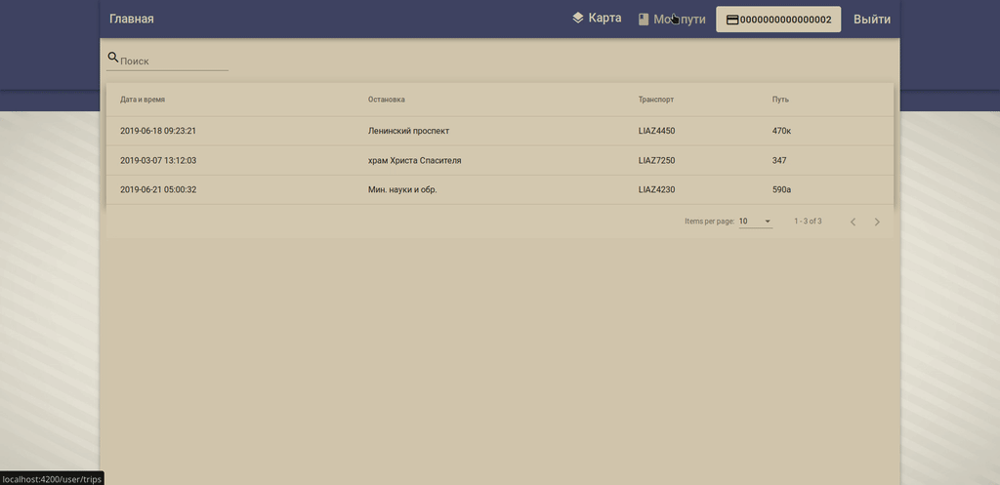
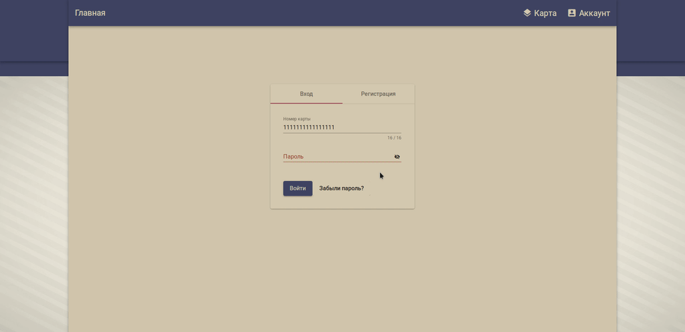
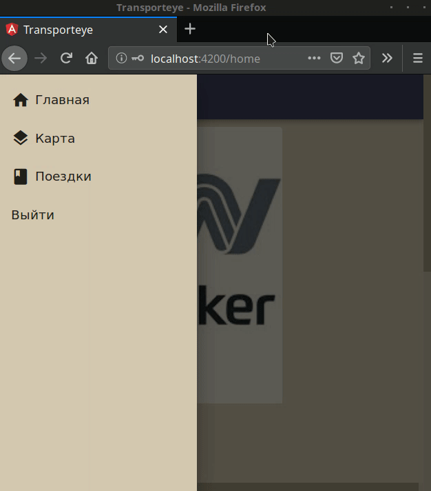

# Transporteye services 

На текущий момент проект состоит из четырех компонент:
* Сервис авторизации/аутентификации (authentication service)
* Сервис с бизнес логикой (transport service)
* База данных (Postgres)
* Клиент сервис (Frontend service (Angular))
* Сервис симуляции данных транспорта (FakeTransport Service)

И предоставляет следующий функционал:

* Отслеживания движения транспорта  


* И статистических данных  


* Просмотр поездок пользователя  


* Модификация остановок админом  


* И других сущностей  


* Регистрация  


* Сброс пароля  


* Боковое меню для маленьких экранов  


## Инструкции для разработчиков

Внимательно прочитайте все что описано ниже, это поможет избежать лишних вопросов.

### Требования

Что вам нужно установить:

Очень желательно иметь Линукс.

Минимум:
* [Java8](https://java.com/ru/download/)
* [Maven](https://maven.apache.org/) - Собирает проект и подтягивает зависимости

Желательно:
* [Docker](https://www.docker.com/) - Запускает каждый сервис в унифицированном контейнере 
* [Docker-compose](https://docs.docker.com/compose/install/) - Чтобы запускать все сервисы сразу

Опционально:
* [Postman](https://www.getpostman.com/) - Тестить апи
* [DBeaver](https://dbeaver.io/) - Тестить базу

### Установка необходимых пакетов в Ubuntu

```
    WORK IN PROGRESS
```

## Сборка и запуск

### Сборка

+ Клонируем репо:
```
    git clone https://github.com/checorone/transporteye.git
```

+ Переходим в деректорию сборки:
```
    cd transporteye
```

+ Собираем сервисы и упаковываем их в докер контейнеры:
```
    mvn clean package docker:build
```
### Запуск вручную

+ Устанавливаем, настраиваем и запускаем PostgreSQL (Зависит от дистрибутива)
    
```
    Заметка: С помощью docker-compose вы можете запускать базу, без каких либо дополнительных настроек и установок. 
    Просто выполните в консоли следующую команду:
    docker-compose -f docker/common/docker-compose.yml up database
```
    
+ Запускаем сервис Аутентификации
```
java -Djava.security.egd=file:/dev/./urandom -Dserver.port=8901         \ 
    -Dspring.datasource.url=jdbc:postgresql://localhost:5432/postgres   \
    -Dspring.profiles.active=default                                    \
    -jar authentication-service/target/authentication-service-0.0.1-SNAPSHOT.jar
```
+ Запускаем сервис Транспорта
```
java -Djava.security.egd=file:/dev/./urandom -Dserver.port=8085 \
    -Dsecurity.oauth2.resource.userInfoUri=http://localhost:8901/user \
    -Dspring.datasource.url=jdbc:postgresql://localhost:5432/postgres \
    -Dspring.profiles.active=default \
    -jar transport-service/target/transport-service-0.0.1-SNAPSHOT.jar
```
+ Открываем и тестируем фронтэнд
```
    frontend-service/src/main/web/indexman.html
```

### Запуск через Docker-compose

Запускаем сервисы:

```
    docker-compose -f docker/common/docker-compose.yml up
```

Останавливаем сервисы:

```
    Ctrl + C
```

Полностью перезапустить сервисы:

```
    docker-compose -f docker/common/docker-compose.yml rm
    docker-compose -f docker/common/docker-compose.yml up
```